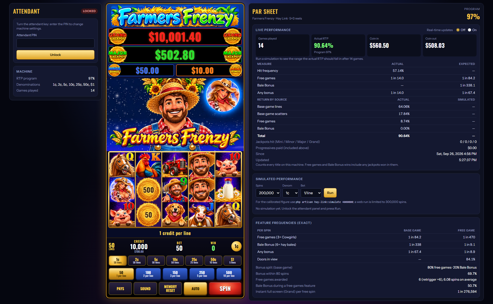

# Farmers Frenzy — a Hay Link slot machine simulator


**Farmers Frenzy** is a slot machine simulator that runs in your browser. It plays like a
*Dragon Link*-style hold-and-spin game. The server runs all of the game math, and the page
keeps **real-time statistics** and a full **PAR sheet**, so you can watch how the machine
actually performs against the math it was built on.



The screen has three parts:

- **Attendant panel (left).** Protected by a PIN. The attendant sets the RTP program,
  deposit limit, autoplay and progressive jackpot values, and can clear the meters.
- **The machine (centre).** Jackpot meters, 5×3 reels, denomination and bet buttons, and
  autoplay.
- **PAR sheet (right).** The game's exact probabilities, a simulator, and live performance
  that updates after every spin.

> [!IMPORTANT]
> **The math is an educated guess, not the real thing.** The real PAR sheets for
> Aristocrat's *Dragon Link* and *Lightning Link* games are Aristocrat's intellectual property
> and are not public. Every number in this project is an **assumption** chosen to make the
> game *feel* like that style of machine and hit a target RTP. That includes the reel strips,
> symbol weights, paytable, bale values, landing chances, jackpot odds and RTP programs. None
> of it is copied from Aristocrat, and none of it will match a real machine.
>
> This is an independent educational and hobby project. It is not affiliated with or endorsed
> by Aristocrat Leisure Limited. *Dragon Link* and *Lightning Link* are trademarks of their
> owners. The game uses play credits only and is **not** meant for real-money gambling.

---

## The game

| | |
|---|---|
| **Layout** | 5 reels × 3 rows, up to 50 paylines, wins pay left to right |
| **Wild** | The **Farmer**, stacked on reels 2–5. He substitutes for every symbol except the Cowgirl and Hay Bales |
| **Scatter** | The **Cowgirl**. 3, 4 or 5 anywhere pay 2×, 10× or 50× the total bet |
| **Free games** | 3+ Cowgirls award 6 free games, and they can retrigger. The free-game reels carry stacked **Barn Doors** that all open to show the same symbol |
| **Bale Bonus** | 6+ **Hay Bales** start the hold-and-spin feature: bales stick and you get 3 respins, reset each time a new bale lands. Fill all 15 positions to win the **Grand** |
| **Jackpots** | **Mini** (20× bet) and **Minor** (100× bet) are fixed. **Major** (starts at $500, capped at $1,000) and **Grand** (starts at $10,000) are progressive and grow with every wager |
| **Denominations** | 1¢, 2¢, 5¢, 10¢ (50 lines), 25¢ (25 lines), 50¢ (10 lines), $1 (5 lines) |
| **Bet levels** | 1, 2, 3, 5 or 10 credits per line |
| **RTP programs** | 90% to 97%, chosen by the attendant (94% by default) |

As on a real machine, the posted pays stay the same in every RTP program. Changing the
program swaps in different reel strips and bonus odds. All game math lives in
[`config/hay_link.php`](config/hay_link.php) and has a comment explaining each setting.

## Real-time stats and the PAR sheet

The PAR sheet panel has several sections:

- **Live performance.** Games played, coin in and coin out, and **actual RTP** compared with
  the program's target. It also shows a 95% confidence band for the actual RTP, hit
  frequency, how often each feature triggers, and how much of the return comes from base game
  lines, scatters, free games and Bale Bonus. Turn on **Real-time updates** to refresh it
  after every spin.
- **Simulated performance.** Runs up to 300,000 spins in the browser (the attendant must be
  unlocked) at any denomination and bet level. The result fills in the *Expected* column of
  the live stats.
- **Exact figures.** Figures calculated directly from the reel strips: feature frequencies
  in the base game and free games, Bale Bonus value tiers, reel bale values, jackpot odds,
  bet-level balancing, the line count at each denomination, and the full paytable.

For long, calibrated runs, use the command-line simulator:

```sh
php artisan hay-link:simulate 4000000                         # 4 million spins at the current settings
php artisan hay-link:simulate 1000000 --rtp=96 --seed=42      # a specific program, reproducible
php artisan hay-link:simulate 1000000 --denomination=25 --credits-per-line=5
```

---

## Installation

### 1. Install the prerequisites

| Tool | Version | Used for |
|---|---|---|
| [PHP](https://www.php.net/downloads) | **8.3 or newer**, with the `pdo_sqlite`, `mbstring`, `openssl` and `fileinfo` extensions (`gd` too if you want to rebuild the artwork) | Running the app |
| [Composer](https://getcomposer.org/download/) | 2.x | Installing PHP packages |
| [Node.js](https://nodejs.org/) | 20.19+ or 22.12+ (npm comes with it) | Building the CSS and JavaScript with Vite |
| [Git](https://git-scm.com/downloads) | any | Cloning the repository |

The quickest way to install PHP and Composer together is [php.new](https://php.new):

```sh
# macOS
/bin/bash -c "$(curl -fsSL https://php.new/install/mac/8.4)"

# Linux
/bin/bash -c "$(curl -fsSL https://php.new/install/linux/8.4)"
```

```powershell
# Windows (run PowerShell as administrator)
Set-ExecutionPolicy Bypass -Scope Process -Force; [System.Net.ServicePointManager]::SecurityProtocol = [System.Net.ServicePointManager]::SecurityProtocol -bor 3072; iex ((New-Object System.Net.WebClient).DownloadString('https://php.new/install/windows/8.4'))
```

Open a new terminal afterwards, then check that everything is on your `PATH`:

```sh
php -v
composer -V
node -v
npm -v
```

### 2. Get the code

```sh
git clone https://github.com/pdinsd/farmers-frenzy.git
cd farmers-frenzy
```

### 3. Install the PHP packages

```sh
composer install
```

### 4. Create your environment file and app key

```sh
# macOS / Linux / Git Bash
cp .env.example .env

# Windows PowerShell
Copy-Item .env.example .env
```

```sh
php artisan key:generate
```

The defaults in `.env` work as they are. One setting you may want to change is the
attendant PIN:

```dotenv
HAY_LINK_ATTENDANT_PIN=1234
```

### 5. Create the database

The app keeps sessions, cache, machine settings, meters and progressive jackpots in a local
SQLite file. Create the empty file, then run the migrations:

```sh
# macOS / Linux / Git Bash
touch database/database.sqlite

# Windows PowerShell
New-Item database/database.sqlite -ItemType File
```

```sh
php artisan migrate
```

### 6. Build the front end

```sh
npm install
npm run build
```

This compiles the Tailwind CSS and the game's JavaScript into `public/build`.

### 7. Run it

```sh
php artisan serve
```

Open **http://127.0.0.1:8000** in your browser. You start with $100.00 in play credits.

- **SPIN** plays one game and **AUTO** keeps spinning. Use the buttons under the meters to
  choose the denomination and bet.
- To change machine settings or run a simulation, enter the attendant PIN (default `1234`)
  in the left panel.
- **MEMORY RESET** starts a new session with a deposit you choose, up to the attendant's
  limit.

### One-step setup (optional)

Steps 3 to 6 are also available as a Composer script. Create `database/database.sqlite`
first (step 5), then run:

```sh
composer run setup
```

### Working on the code

To rebuild CSS and JavaScript automatically as you edit them, use the Vite dev server
instead of `npm run build`:

```sh
npm run dev          # in one terminal
php artisan serve    # in another
```

Run the test suite:

```sh
php artisan test
```

The symbols, logo, jackpot badges and background are cut from the source artwork in
[`artwork/farmers_frenzy`](artwork/farmers_frenzy). If you change that artwork, regenerate
the images (this needs the `gd` extension):

```sh
php artisan farmers-frenzy:extract-artwork
```

## Project layout

| Path | What's there |
|---|---|
| [`config/hay_link.php`](config/hay_link.php) | All game math: reels, paytable, bale values, jackpots, RTP programs |
| [`config/themes.php`](config/themes.php) | Machine themes: artwork folder and symbol names |
| [`app/Games/HayLink`](app/Games/HayLink) | Game engine: reel sets, payline evaluation, Bale Bonus, jackpots, meters, PAR sheet, simulator |
| [`app/Http/Controllers`](app/Http/Controllers) | Machine and attendant endpoints |
| [`resources/js/machine.js`](resources/js/machine.js) | Front end: reel animation, controls, live PAR sheet updates |
| [`resources/views`](resources/views) | Blade templates for the machine, attendant panel and PAR sheet |

## License

Released under the [Apache License 2.0](LICENSE).
